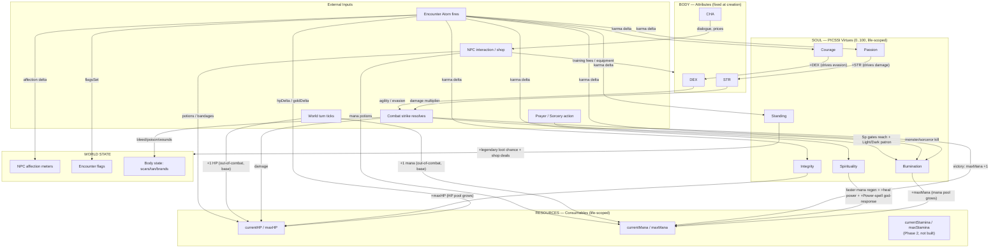

# KARMA_SYSTEM.md — Living Eamon's Karmic Web

> **Status:** Stage I draft (Plan, not yet approved). All math is **PROPOSAL** until Scotch greenlights it.
> **Scope:** Umbrella diagram of how PICSSI virtues, attributes (STR/DEX/CHA), consumables (HP/mana/stamina), NPC affection, and encounter atoms interconnect.
> **Workflow:** Each component goes through three stages — **I. Plan** → **II. Approval** → **III. Implement**. Checkboxes track which stage each component has reached. Nothing checks "Implement" without "Approval" first.
> **Last updated:** 2026-04-29

---

## 0. Vision (one paragraph)

Karma is the soul-mirror Jane uses to turn the world into a reflection of the player. Every meaningful choice ripples outward: it shifts one or more of the six **PICSSI virtues** (Passion, Integrity, Courage, Standing, Spirituality, Illumination — see GAME_DESIGN.md §11 for the canonical definitions), nudges **NPC affection** for whoever was watching, and may set durable **encounter flags**. PICSSI in turn drives the player's **physical attributes and resource caps** per the canonical mapping in GAME_DESIGN.md §11:

| Virtue | Direct mechanical link (canonical) |
|--------|-------------------------------------|
| **Passion** | → Strength (STR attribute) |
| **Integrity** | → maxHP |
| **Courage** | → Dexterity (DEX attribute) |
| **Standing** | → legendary loot luck (chance of legendary magic weapons in treasure) |
| **Spirituality** | → mana regen rate, heal-spell power, Power-spell god-response chance |
| **Illumination** | → maxMana (and the Outer Dark cosmology gate at low/negative values) |

Attributes are not "fixed for life" — they're driven by their linked PICSSI virtue. As Passion grows, STR grows. As Courage grows, DEX grows. As Integrity grows, maxHP grows. PICSSI is therefore not a multiplier *over* the body — it IS the body's growth axis.

**The central feedback loop (decided 2026-04-29, refined later same day):** PICSSI virtues grow through **multiple surface areas**, NOT all of them tied to stamina-recovery. **Don't assume every virtue has a rest-activity path** — Scotch corrected this explicitly:
- **Passion** grows through atom choices + select stamina-recovery activities (drinking, brothel, gambling, hunting, sex, combat).
- **Integrity** grows ONLY through atom commitment-tests (kept vows, delivered items, refused bribes). **No stamina-recovery path.**
- **Courage** grows ONLY through combat and other moments of overcoming fear (gambling, brothel — minor — both involve real risk). **No stamina-recovery path.** *Stamina recovery does not feed Courage.*
- **Standing** grows through public deeds, generosity, wealth display, and combat victories. Has loose stamina-recovery overlap (bathhouse = some Standing) but the canonical sources are the social-display list in §2.8.
- **Spirituality** grows through prayer (the primary stamina-recovery path), respect for shrines, leaving offerings.
- **Illumination** grows toward Light through killing dark beings, healing innocents, restoring holy sites, and reading specific books (notably **The Scrolls of Thoth** — 15 in-game scrolls modeled on the Kybalion). Grows toward Dark through sorcery use (per the logarithmic curve in GAME_DESIGN.md §11: Circles 1–3 only narrative warnings, Circles 4+ real Illumination loss).

The body-zone two-turn-types pattern (combat-round vs world/camp turn) still structures the game's pacing. **Stamina is the central pacing currency**, and several rest activities DO grow PICSSI — but the framing "how they rest is who they become" is too narrow. Combat, atom choices, and book-reading are equally weighty PICSSI sources.

---

## 1. Stock & Flow Diagram

### 1.1 Mermaid (renders in GitHub, Cursor preview, most markdown viewers)



### 1.2 ASCII (universal fallback)

```
                       EXTERNAL INPUTS
        ┌──────────┬──────────┬──────────┬──────────┐
        │  ATOM    │ COMBAT   │  TURN    │  SHOP    │
        │ FIRES    │ STRIKE   │  TICK    │ INTERACT │
        └────┬─────┴────┬─────┴────┬─────┴────┬─────┘
             │          │          │          │
             ▼          ▼          ▼          ▼
   ┌─────────────────────────────────────────────────────┐
   │ SOUL — PICSSI                                       │
   │   five virtues 0..100, Illumination −100..+100      │
   │   reset on death                                    │
   │                                                     │
   │   Passion ────► STR     (max physical strength)     │
   │   Integrity ──► maxHP   (life pool)                 │
   │   Courage ────► DEX     (max dexterity / evasion)   │
   │   Standing ───► loot luck + shop deals (no stat)    │
   │   Spirit ─────► mana regen + heal/Power power       │
   │   Illum ──────► maxMana (Outer Dark gates @ low)    │
   └─────────────────────────────────────────────────────┘
        │ growth-of-attribute (NOT a multiplier — soul IS body's growth axis)
        │
        ▼
   ┌─────────────────────────────────────────────────────┐
   │ BODY — STR / DEX / CHA                              │
   │   base set at creation, GROWN by linked PICSSI      │
   │   STR_eff = STR_base + f(Passion)  [formula §2.4]   │
   │   DEX_eff = DEX_base + f(Courage)                   │
   │   CHA: independent, separate epic                   │
   └────┬────────────────────────────────────────────────┘
        │ used in
        ▼
   ┌─────────────────────────────────────────────────────┐
   │ RESOURCES (consumables)                             │
   │   HP / maxHP    — drains in combat, +1/turn OOC     │
   │   Mana / maxMana — drains on cast, +1/turn OOC      │
   │   Stamina / maxStamina + fatiguePool (body-zone-derived) │
   │                                                     │
   │   STR also drives damage (combatEngine.ts:319)      │
   │   DEX drives agility / evasion (combatEngine.ts:47) │
   └─────────────────────────────────────────────────────┘

   WORLD STATE (alongside): NPC affection, flags, body state.
   Atom outcomes + combat outcomes + book-reading write into all three.
```

---

## 2. Stock Inventory

Each stock has three Stage-I sub-tasks (max math · use/replenish math · dependencies), then Stage II (approval) and Stage III (implementation). Checkboxes are honest: a box checks only when the component is shipped to runtime.

### 2.1 currentHP / maxHP

**Canonical link (GAME_DESIGN.md §11):** Integrity → maxHP. *(Note: GAME_DESIGN.md §11's Integrity section text reads "the more Courage the more maximum Hit Points" but the section heading is "I — Integrity" — apparent typo; treating Integrity as canonical link until corrected. Flagged in §4b.)*

- [ ] **I.1 Max math (best-guess; Machinations.io will tune):**
  `baseMaxHP = 50` (constant, set at creation).
  `maxHP = baseMaxHP + 2 × Integrity` → Integrity 0 = 50; Integrity 50 = 150; Integrity 100 = 250.
  **Lifecycle:** baseMaxHP is fixed at creation. Integrity drifts during life via atom commitment-tests. maxHP recomputes whenever Integrity changes.
- [ ] **I.2 Use/replenish math:**
  Damage in: combat strikes (existing). Out-of-combat passive regen: `+1 HP/turn` (existing baseline retained — Spirituality affects MANA regen, not HP regen, per canonical doc).
  Potions: existing values unchanged (heal +15, greater +35).
  HEAL spell: existing 18–32 base; **Spirituality boosts HEAL power** per GAME_DESIGN.md §11 ("increases power of heal spell"). Proposed: HEAL output = base × (1 + 0.005·Spirituality) → Spirituality 100 = 1.5× heal output (~28-48 instead of 18-32).
  Bandage: still mitigates bleed only.
- [ ] **I.3 Dependencies / balancing:**
  - High-Integrity hero (50+) tanks 3× more punishment per life than low-Integrity. Atom-design implication: Integrity-growth atoms must be RARE enough that maxHP 250 represents a defining moral arc, not casual play.
  - HP regen does NOT scale with Integrity (per canonical doc). Stamina/fatiguePool remains the pacing brake.
  - Saves: `recomputeMaxHP(state)` helper runs on every Integrity delta, on PlayerState load, and on character creation.
- [ ] **II. Approval**
- [ ] **III. Implementation** — touches `lib/gameState.ts` (recompute helper), `lib/combatEngine.ts:resolveCombatSpell` (HEAL Spirituality multiplier). DB migration: none (HP/maxHP already columns).

### 2.2 currentMana / maxMana

**Canonical link (GAME_DESIGN.md §11):** Illumination → maxMana. Spirituality → mana regen rate.

- [ ] **I.1 Max math (best-guess; Machinations.io will tune):**
  `baseMaxMana = 10` (current default). Existing `+1 per combat victory` retained.
  `maxMana = baseMaxMana + |Illumination| / 2` → uses ABSOLUTE value of Illumination because GAME_DESIGN.md §11 describes saints AND daemons as equally "Illuminated"; the bored midline is the lowest state. Illumination ±100 = +50 maxMana. Illumination 0 = no bonus.
  Stacking semantics: combat-victory `+1 per kill` grows base; |Illumination| adds on top. Example: Illumination −80 hero who has won 30 fights = `10 + 30 + 40 = 80 max mana`.
  **Note:** Illumination at the dark pole (negative) gives the same maxMana boost as the bright pole — but at low/negative values, GAME_DESIGN.md §11 also opens the "Outer Dark gates" (wider patron-response for INVOKE), which is its own separate effect on Sorcery (see SORCERY.md once extracted).
- [ ] **I.2 Use/replenish math:**
  Out-of-combat regen: `1 + floor(Spirituality / 20)` mana/turn → Spirituality 20 = 2/turn, Spirituality 100 = 6/turn. (Spirituality, NOT Illumination, drives regen rate.)
  Mana potion: existing +10.
  Sorcery (INVOKE) cost: see GAME_DESIGN.md §9 for per-circle mana costs (4 / 6 / 9 / 11 / 14 / 20 / 40 / 50 across the Eight Circles).
- [ ] **I.3 Dependencies / balancing:**
  - At Illumination ±100, maxMana = 60–110 (depending on combat victories). Circle-7 spells cost 40 mana each — so two casts before refill. Circle-8 (50 mana) is a single shot. That seems reasonable for endgame.
  - Spirituality regen rate (6/turn at Spirit 100) is faster than any reasonable spell cost — a saintly hero can cast freely between fights. Counter-balance via stamina + actionBudget: every cast also costs stamina, so spells are gated by the rest economy.
  - Migration consideration: existing players migrate with Illumination 0 → no maxMana change.
- [ ] **II. Approval**
- [ ] **III. Implementation** — `lib/gameState.ts`, `lib/gameEngine.ts:tickWorldState`, `lib/combatEngine.ts:resolveCombatSpell`.

### 2.3 currentStamina / maxStamina + fatiguePool (body-zone-derived dual-pool model)

**Decision 2026-04-29:** Stamina ships **before** PICSSI multipliers, modeled directly on the source combat model's `player_stamina` + `player_fatigue_pool` dual-pool design (body-zone `script.rpy:4077, 9389-9397`). Stamina is the central pacing currency; without it, PICSSI multipliers spiral.

**Two-pool model (body-zone-derived):**

- **`stamina`** (current) — the short-term action capacity. Drained by combat strikes, spells, hard travel. Refilled to max by any rest activity.
- **`maxStamina`** — the cap on `stamina`. Set by `35 + 2·STR_effective` (body-zone uses endurance; we map to STR). **Note:** because STR_effective grows with Passion (§2.4), Passion indirectly raises maxStamina. We do NOT add a separate Passion×stamina multiplier on top — that would double-count Passion's effect.
- **`fatiguePool`** (chronic exhaustion) — a SEPARATE accumulator that **goes negative** during heavy combat and recovers via rest activities. Drives 5 fatigue levels (0-4) with combat penalties at each tier. This is the body-zone insight: short-term and chronic exhaustion are distinct pools.

**body-zone fatigue thresholds (adopted as-is):**
- Level 0 (Fresh): `fatiguePool > -maxStamina`
- Level 1: `fatiguePool ≤ -maxStamina`
- Level 2: `fatiguePool ≤ -maxStamina × 2`
- Level 3: `fatiguePool ≤ -maxStamina × 3`
- Level 4 (Exhausted, can't act): `fatiguePool ≤ -maxStamina × 4`
Each level imposes combat penalties (TBD specifics — we'll match the body-zone table once we read `script_2.rpy`).

**Per-adventure action budget (also body-zone-derived):**
body-zone uses `time_left = 25` per chapter — a hard cap on rest actions per story arc. We adopt: **`actionBudget = 25` per adventure expedition** (resets when player returns to Ostavar). Rest activities cost 1 `actionBudget` (bathhouse-equivalent costs 2). When `actionBudget = 0`, no more rest is possible until return-to-hub.

- [ ] **I.1 Max math (best-guess; Machinations.io will tune):**
  `maxStamina = 35 + 2 × STR_effective` (STR_effective = STR_base + floor(Passion / 10), see §2.4).
  Worked examples: Passion 0 + STR_base 10 → STR_eff 10 → maxStamina 55. Passion 50 + STR_base 10 → STR_eff 15 → maxStamina 65. Passion 100 + STR_base 12 → STR_eff 22 → maxStamina 79.
  Lifecycle: maxStamina recomputes whenever Passion changes (because STR_effective changes).

- [ ] **I.2 Use/replenish math (best-guess values; will tune via Machinations.io later):**

  **Drains:**
  - Combat strike: 5–13 stamina per attack (weapon-specific; body-zone uses per-weapon `stam_cons1`/`stam_cons2`)
  - Spell cast: 5 stamina per spell (in addition to mana cost)
  - Heavy travel (between rooms in a hostile zone): 1 stamina per move (peaceful zones free)
  - **Combat ALSO drains fatiguePool by the same amounts.** When fight ends, `fatiguePool` recovery formula: `fatiguePool += enemiesKilled × maxStamina × 1.5` (body-zone combat-direct). Fallback if no kills: `fatiguePool += maxStamina × 0.5`.

  **Recovery activities (each consumes 1 `actionBudget`, fully restores `stamina = maxStamina`, plus boosts fatiguePool):**

  | Activity | Stamina restored | fatiguePool restored | PICSSI grown | PICSSI lost | Other cost/effect |
  |----------|------------------|----------------------|--------------|-------------|--------------------|
  | Hang around (sleep at inn) | full | +0.5 × maxStamina | none (neutral) | none | gold for room |
  | Drink (tavern, alone) | full | +2.0 × maxStamina | **+Passion** (small) | none | needs ale/wine item |
  | Drink and buy others drinks | full | +2.0 × maxStamina | **+Passion** + **+Standing** (generosity) | none | extra gold (rounds) |
  | Buy meals for others (tavern) | full | +1.0 × maxStamina | **+Standing** (generosity) | none | gold cost |
  | Brothel | full | full reset (−0 fatigue) | **+Passion** + minor **+Courage** (real risk) | **−Spirituality**; small chance **−STR** via venereal disease (see §2.13a) | gold cost (Vivian-discount possible) |
  | Gamble (dice/cards) | full | +0.67 × maxStamina | **+Passion** + minor **+Courage** (real risk of gold loss) | none | gold-at-risk |
  | Hunt (wilderness) | full | +0.67 × maxStamina | **+Passion** | none | injury risk, brings game/hide |
  | Pray (temple) | full | +0.29 × maxStamina | **+Spirituality** | none | optional donation gold |
  | **Pray at fertility temple** (= cures VD) | full | +0.29 × maxStamina | **+Spirituality** + cures venereal disease (if god responds) | none | optional donation; ironic note: same building hosts the most popular brothel |
  | Donate to temple (without praying) | n/a | +0 | **+Standing** *(NOT Spirituality — canonical irony per chat)* | none | gold cost, "public charity, not piety" |
  | Mortify flesh / fast / vigil | full | +1.0 × maxStamina | **+Spirituality** + bleed_count | none | self-harm tradeoff |
  | Read a Scroll of Thoth (first time) | n/a (no stamina effect) | +0 | **+Illumination toward Light** (per scroll, e.g. +3 Notable; subject to riddle-verification) | none | quest-loot scroll required |
  | Star-gaze / scry / scholar-talk *(TBD; deferred — Courage doesn't use this slot)* | full | +0.5 × maxStamina | **+Illumination** (Light) | none | quiet, no risk |
  | Cast Sorcery (Circles 4+, out-of-combat) | drains stamina | drains fatiguePool | none | **−Illumination toward Dark** (Circles 1–3 narrative-only; Circles 4+ real loss per GAME_DESIGN.md §11) | reagent + mana cost |
  | Bathhouse (luxury) | full | +2.0 × maxStamina | **+Standing** (visible luxury) | none | 2 actionBudget + 55g |
  | Wear expensive gear / jewelry / be flashy | n/a (passive) | n/a | **+Standing** (passive while equipped) | none | upkeep / gear value |
  | Be rich (passive: bank balance > threshold) | n/a | n/a | **+Standing** (passive tier-based) | none | wealth accumulation |
  | Play lute / music | full | +0.5 × maxStamina | small **+Passion** | none | needs lute, can fail at low skill |

  **NOTE — virtues that have NO stamina-recovery path** (per Scotch 2026-04-29):
  - **Courage:** grows ONLY through combat, gambling (lesser), brothel (minor — risk-of-thieves/VD). No "rest activity" gives Courage.
  - **Integrity:** grows ONLY through atom commitment-tests. No rest activity gives Integrity.
  - **Earlier "Spar / dangerous-game hunt → +Courage" entry was wrong and is removed** (Scotch correction).

  **Recovery values are body-zone combat-direct.** PICSSI mappings reflect chat 2026-04-29 + GAME_DESIGN.md §11.

- [ ] **I.3 Dependencies / balancing:**
  - Stamina + fatiguePool together solve the PICSSI-multiplier scaling problem. A Courage-50 hero with 6 HP/turn out-of-combat regen can only regen between actions while `stamina > 0`. When stamina is gone, they need a rest action, which costs `actionBudget`. After 25 rests, they're forced to return to hub. So PICSSI multipliers can run hot without breaking the game.
  - Adventure design impact: an adventure expedition is ~25 actions long. Dungeons must be tuned to that economy.
  - Out-of-combat HP/mana regen continues 1/turn (existing) ONLY while `stamina > 0`. When exhausted, regen stalls.
  - Hunger/thirst (a separate Phase 2 system) layers ON TOP of stamina/fatigue, not parallel. Defer.
- [ ] **II. Approval**
- [ ] **III. Implementation** — new columns `current_stamina`, `max_stamina`, `fatigue_pool`, `action_budget` on players. PlayerState + tick paths + activity dispatcher.

### 2.4 STR / DEX / CHA (Attributes)

**Canonical link (GAME_DESIGN.md §11):** Passion → STR; Courage → DEX. CHA is independent (no PICSSI link documented).

- [x] **Currently exists in code:** STR multiplies damage (`combatEngine.ts:319`), DEX feeds agility/evasion (`combatEngine.ts:47`), CHA is currently unread.
- [ ] **STR derivation (best-guess; canonical "Passion → STR" but no formula in GAME_DESIGN.md):**
  `STR_effective = STR_base + floor(Passion / 10)` → Passion 0 = +0; Passion 50 = +5; Passion 100 = +10. Base STR is set at creation (currently 10 default), so a Passion-100 hero has effective STR 20 — at the top end of typical sword-and-sorcery scaling.
  **Open question §4b:** is the link additive (above), capped, or multiplicative? Need Scotch's intent.
- [ ] **DEX derivation (best-guess; canonical "Courage → DEX"):**
  `DEX_effective = DEX_base + floor(Courage / 10)` → same pattern.
  Courage's combat-evasion effect therefore stacks: high Courage gives +DEX → +evasion, AND atom rewards keep adding.
- [ ] **CHA:** No PICSSI link in GAME_DESIGN.md. Currently dead in code; wiring it is a separate epic. Open question §4b: should CHA be Standing-linked (high Standing = high CHA), or stay independent?
- [ ] **Implementation:** `recomputeDerivedStats(state)` reads Passion/Courage and writes the *_effective values; combat code reads the effective values, not the base.

### 2.5–2.10 PICSSI Virtues (six stocks)

Each PICSSI virtue is its own stock. **Five of the six (Passion, Integrity, Courage, Standing, Spirituality) are unipolar (0..100, floor at 0).** Illumination is **bipolar (−100..+100)** — see §2.10. They share mutation mechanics but differ in growth source and downstream effects.

**Common mechanics (apply to all six):**

- [ ] **I.1 Max math:**
  Default at creation: **0** for unipolar; **0** for Illumination (neutral, neither Light nor Dark).
  Ceilings: clamp to range. Excess deltas cap silently (no narrative overflow event in v1).
  Reset: **full reset** on hero death — every PICSSI virtue returns to 0 for the next life.
- [ ] **I.2 Mutation magnitude bands (canonical, used by atom library):**
    - Trivial choice: ±1
    - Notable choice: ±3
    - Major choice: ±5
    - Defining choice: ±10
- [ ] **I.3 Common dependencies:**
  - Atom corpus must be large enough that natural play can reach virtue ≥50 in a life. Rough math: average ±3/atom × ~17 atoms = +51 net. Alpha target is 20–30 atoms minimum.
  - Cross-virtue tension: some atoms force tradeoffs (e.g., Integrity vs Standing if loyalty conflicts with reputation). Content design, not engine.

**Per-virtue specifics (per Scotch's 2026-04-29 design notes + canonical GAME_DESIGN.md §11):**

#### 2.5 Passion — embodied intensity, drive, vitality (→ STR)

- **Canonical link:** Passion → STR (the more Passion, the higher Strength). See §2.4 for the additive formula.
- **Growth sources:** atom choices in passionate scenes + select stamina-recovery activities. Per chat 2026-04-29: combat itself (hunt-thrill / battle-rage), drinking, brothels, gambling, hunting, sex. Per GAME_DESIGN.md §11: bold pursuits, declarations of intent, choosing decisively, taking women, getting high or drunk, kissing, fondling.
- **Loss sources** (GAME_DESIGN.md §11): hesitation, indecision, listless drifting, half-measures, slow action, abandoning quests partway out of boredom.
- **Modulates:** STR (which drives damage), maxStamina (via STR), eros-axis content gates (high Passion unlocks Vivian's intimate dialogue, etc.). Per GAME_DESIGN.md: "attracts passionate women."

#### 2.6 Integrity — keeping one's word, honoring vows (→ maxHP)

- **Canonical link:** Integrity → maxHP (per GAME_DESIGN.md §11, though the section text has an apparent typo saying "Courage" instead of "Integrity" — flagged in §4b).
- **Growth sources** (canonical + chat): completing committed quests on time, keeping vows, paying debts, returning rescued items, owning up to failures publicly, refusing bribes that would break a prior promise. Atom commitment-tests are the primary engine: "Will you do this for me?" → keep the promise = +Integrity. "Deliver this magical item to far-town NPC" → deliver intact = +Integrity, sell for gold = large −Integrity. Assassin quests where the target offers more money to spare them = ultimate Integrity test.
- **Loss sources:**
  - Breaking explicit promises in atoms.
  - Concealing failures, lying to NPCs, abandoning declared goals without acknowledgment.
  - **Leaving allies behind in combat = −Integrity** (per Scotch 2026-04-29: combat alongside allies carries an implicit commitment to fight together).
- **No stamina-recovery path.** Per chat 2026-04-29: "Integrity has nothing to do with stamina-recovery." Integrity grows only through atom commitment-tests, not through rest activities.
- **Modulates:** maxHP (canonical). Known-spells cap (mages teach trustworthy students more), training-fee discounts, certain unique items (only sold to known-trustworthy heroes). Per GAME_DESIGN.md: "attracts wise women."
- **Atom themes:** delivery quests, promise-keeping over time, betrayal scenarios, sworn oaths, ally-abandonment-under-fire.

#### 2.7 Courage — passion in the face of danger (→ DEX)

- **Canonical link:** Courage → DEX (the more Courage, the higher Dexterity). See §2.4.
- **Growth sources** (canonical + chat: NO stamina-recovery path):
  - **Combat moments** of overcoming fear — facing overwhelming odds and choosing to STAY = +Courage **whether they win or lose**. The act of staying is the virtue, not the outcome.
  - **Other risk-vs-avoidance decisions:** gambling (lesser; real risk of gold loss), brothel (minor; per chat: "women can be scary thieves and assassins, and venereal diseases definitely are").
  - Per GAME_DESIGN.md §11: engaging unbeatable-looking odds, refusing to flee from monstrous threats, protecting weaker against stronger, accepting trial-by-combat against superior foes.
- **No stamina-recovery path** (per chat 2026-04-29: "Courage has no relationship to stamina-recovery. Courage is only gained through combat or other moments of overcoming fear — a player decision to face risk instead of avoid it"). Removed earlier-proposed sparring / dangerous-game-hunting recovery activity.
- **Loss sources:**
  - **Fleeing combat ALWAYS = −Courage** (per Scotch 2026-04-29: "fleeing at all always reduces Courage"). Magnitude scales with pressure: great-odds flee costs more than routine flee. Ordered retreat (covering allies' flee first) still costs Courage at the standard solo-flee tier.
  - **Fleeing AND leaving allies behind = LARGEST Courage loss** (the "ultimate act of cowardice," Defining-tier ≥ −10).
  - Per GAME_DESIGN.md §11: attacking only when victory is certain, refusing trials.
- **Modulates:** DEX (which drives evasion). Per GAME_DESIGN.md: "attracts romantic women."
- **Atom themes:** stay-or-flee under fear, defending the helpless, accepting a duel against superior fighter, refusing to surrender, trials-by-combat.

#### 2.8 Standing — visible standing, victory, masculinity, virility (→ legendary loot luck)

> **The essence of Standing** (canonical, per Scotch 2026-04-29):
>
> > *"What is best in life?"*
> > *"To crush your enemies, to see them fall at your feet — to take their goods and hear the lamentation of their women."*
>
> Pictish war-chieftain's catechism in Thurian-Age fiction; PD-derived from Harold Lamb's 1927 Genghis Khan translation (and Rashid al-Din, ~1300). Full lore + atom hooks + PD provenance in [lore/standing-creeds/the-conquerors-question.md](./lore/standing-creeds/the-conquerors-question.md). This is the unalloyed root of Standing — visible victory, public domination, the wealth and glory that follows the strong.

- **Canonical link:** Standing → loot luck (per GAME_DESIGN.md §11: "Increases chance of legendary magic weapons appearing in treasure and loot"). Standing does NOT directly modify a base attribute. Its mechanical effect is gear-economy + NPC dynamics, not stat math.

- **Growth sources (canonical list, per chat 2026-04-29 + GAME_DESIGN.md §11):**
  - **Combat victories** (especially decisive ones), feats of physical power, visible domination over physical challenges, public displays of vigor.
  - **Buying others a drink while drinking** at a tavern.
  - **Buying others food.**
  - **Being generous with allies and the poor.**
  - **Being rich** — large bank balance is itself a Standing source (passive).
  - **Wearing expensive gear** — carrying/wearing high-value armor, weapons, or accessories registers as Standing.
  - **Wearing jewelry.**
  - **Being flashy** — fashion, retinue display, conspicuous consumption.
  - **Donating to the temple** — *ironic note (canonical, per chat 2026-04-29):* temple donations grow **Standing**, not Spirituality. The act is read as public charity (visible), not private piety.

- **Loss sources:**
  - **Fleeing combat** (per Scotch 2026-04-29: both Standing and Courage lost from fleeing).
  - **Leaving allies behind in combat = LARGE Standing loss** (per Scotch 2026-04-29: "Standing is GREATLY decreased by leaving allies behind in combat"). Magnitude proposed: −10 to −15 (Defining-tier) per ally abandoned. Distinct from a generic flee penalty.
  - **Note: Leaving allies behind is the canonical TRIPLE PENALTY** — it costs Standing AND Integrity (broken implicit vow, §2.6) AND Courage (Defining-tier cowardice, §2.7). The most-punished moral failure in the karma model.
  - **Losing combat after standing** (per the Courage-Standing tradeoff): standing against great odds and losing raises Courage but reduces Standing.
  - Per GAME_DESIGN.md §11: combat defeats, public displays of weakness, illness, public humiliation, being subdued without resistance.

- **Modulates:** legendary loot chance (canonical primary effect), shop deals (proposed: ×(1 − 0.02·Standing) on prices), NPC gift quantities (+0.05·Standing on bonus rolls), lodging cost, training fees. Per GAME_DESIGN.md: "attracts lusty women."

**Ordered Retreat (key mechanic, per Scotch 2026-04-29):**
> "When bringing allies into combat, the only way to flee without any real sense of Integrity and Standing loss is to make sure your allies flee first. Mechanically this is accomplished by pressing their Flee button first, then fleeing yourself next turn."

This means combat has a **per-ally Flee command** that the player can issue on the ally's turn. If the player issues Flee for every ally on prior turns and only then flees themselves, the action is judged as **"ordered retreat"**:
- Standing and Integrity are spared (no penalty).
- Courage is still reduced (you still ran from the fight) — but only the standard solo-flee tier, not the Defining-tier cowardice.

The disciplined commander covering his men's retreat is not branded a coward like the abandoner. Implementation requires: per-ally action queue + per-ally `hasFled` boolean + flee-resolution check `allAlliesFled === true`.

**Group-flee mechanics (per Scotch 2026-04-30):**
- **Max party size = 3** (hero + 2 allies). Hard cap driven by the combat UI screen, which has room for exactly two ally slots.
- **FLEE trigger on the ally combat UI:** clicking FLEE on ANY ally's row → that NPC AI-rolls a random exit on the same turn → the whole group (any allies still able to flee + the hero) lands in the chosen room next tick. Player does not pick the direction; this matches Eamon's group-flee feel.
- **Broken-legged / cannot-flee allies:** if an ally has `broken_leg` (or any flee-blocking effect), the engine reports `"<ally> cannot flee"` and presents a binary confirmation:
  - **Cancel flee** → group stays in combat. No penalty.
  - **Flee anyway** → remaining able allies + hero retreat; the immobile ally is **abandoned**. Apply the leave-ally-behind triple penalty (§2.6 Integrity, §2.7 Courage, §2.8 Standing) **scaled by the count of allies left behind** (1 ally = 1× the per-ally magnitudes; 2 allies left behind = 2× the per-ally magnitudes).
- **Stand-and-cover alternative:** if the player chooses to stay with an immobile ally rather than abandon, that's a stand-and-lose (§4c) with bonus Courage credit on resolution. (Future: a dedicated "STAND AND COVER" combat action that boosts ally HP regen one round at the cost of player stamina — design only, not yet wired.)

- **Atom themes:** public recognition, peerage, formal court, generosity-vs-greed forks, conspicuous consumption, ally-abandonment scenarios.

#### 2.9 Spirituality — respect for and inner sense of the spiritual (→ mana regen rate, heal-spell power, Power-spell god-response)

- **Canonical link (GAME_DESIGN.md §11):** Spirituality → mana regen rate, +heal-spell power, +chance gods respond to Power-spell prayer. The **Conan-Crom paradigm** is canonical: Crom only cares about *witnessing* his hero's strength and courage in the face of hopelessness, never overtly intervenes during battle, but blesses successful heroes after the fact. *The praying itself is the virtue, not the answer.*
- **Growth sources** (canonical):
  - **Prayer at temples** (primary stamina-recovery path; fully restores stamina + grows Spirituality + a chance the prayer is "answered" downstream).
  - Pilgrimage atoms, mortification of the flesh, pious denial.
  - Respecting shrines and holy ground; conducting oneself as if observed by gods; leaving offerings.
- **Loss sources** (canonical + chat):
  - Blasphemy, defiling sacred sites, mocking priests, dismissing oaths sworn to gods.
  - Performing sorcery on consecrated ground.
  - **Visiting brothels reduces Spirituality** (per chat 2026-04-29; see §2.13 Brothel + VD mechanic). The fertility-temple-as-brothel exception adds a layer of irony: the same act that generates Spirituality (prayer at temple) and the same act that drains it (brothel-rest) coexist at the fertility temple specifically.
- **Modulates:** mana regen rate (canonical primary effect), HEAL spell power (proposed: +0.5% heal output per Spirituality point, capped at +50%), Power-spell god-response chance, prayer reach (which deities will respond — low Spirituality narrows the field). Per GAME_DESIGN.md: "attracts spiritual women."
- **Atom themes:** temple visits, deity choice, sacrifice-for-faith, miracle witness, demonic temptation, fertility-rite scenes.

#### 2.10 Illumination — the soul's balance between Light and Dark **(BIPOLAR, −100..+100)** (→ maxMana)

- **Canonical link (GAME_DESIGN.md §11):** Illumination → maxMana. Both extremes increase the cap (saints and daemons are equally "Illuminated"; the bored midline is the lowest social-status state).
- **Range:** integer **−100..+100**. Default 0 (neutral). Negative = Darkness (selfish power, lust, greed, sorcery). Positive = Light (helping fight the Cataclysm at personal expense).

- **Growth toward Light** (canonical + chat):
  - **Killing beings of darkness:** daemons, undead, sorcerers, dark cults. Per chat 2026-04-29: "fighting monsters and sorcerors is one way."
  - **Saving innocent lives**, healing the helpless, restoring desecrated holy sites.
  - **Reading sacred texts.** Per chat 2026-04-29: there are books in the game that increase Illumination, including **The Scrolls of Thoth** — 15 scrolls modeled word-for-word on Hermes Trismegistus's *The Kybalion*, with Hermes/Hermes Trismegistus replaced by Thoth. The 15 scrolls are objects of quests; finding and reading each one gives an Illumination boost toward Light.
  - **Riddle-verification mechanic (per chat 2026-04-29):** to confirm the player actually READ a scroll (not just possessed/discarded it), in-game riddles or NPC dialogue gates use fill-in-the-blank prompts drawn from the scrolls. Example: *"As Above, So _____"* (canonical Hermetic answer: "Below"). Implementation: each scroll registers a list of `{prompt, blank, answer}` tuples; quest gates draw from a player's read-scrolls set; Illumination is awarded only on first successful read+verify, not on second-or-later reads. See `project_scroll_riddle_verification.md` memory.

- **Growth toward Dark** (canonical):
  - **Sorcery use** (every INVOKE casting). Per GAME_DESIGN.md §11 (canonical, more nuanced than my earlier draft): Circles 1–3 do NOT directly shift Illumination — they only deliver narrative warnings (Circle 2: "this feels dark in subtle ways"; Circle 3: "a dark presence is near"). **Circles 4+ darken Illumination directly**, in a logarithmic relationship — the more powerful the sorcery, the darker the soul. (Proposed magnitudes pending; see SORCERY.md after extraction.)
  - **Killing innocents**, sacrificing the helpless, defiling holy sites, performing necromancy.

- **NOT zero-sum:** A hero who heals an orphanage in the morning and casts INVOKE at night accumulates BOTH Light gain and Darkness gain. The scoring weighs absolute distance from midline. The bored midline (Illumination 0) is the LOWEST social-status state.

- **Modulates:**
  - maxMana (canonical). Both extremes count: |Illumination| determines the bonus.
  - **Outer Dark gates (low/negative Illumination):** at strongly negative Illumination, GAME_DESIGN.md §11 describes a "wider door" for Outer Dark gods to answer INVOKE attempts. The Eight Circles thus become darker AND more powerful as the hero descends. Detailed mechanics in SORCERY.md (after extraction).
  - **Prayer reach split (canonical):** low-Illumination heroes find that only dark gods answer their prayers; high-Illumination heroes find that bright gods answer. Mid-Illumination = inconsistent or weak answers.
  - **NPC romance attraction at both extremes** (canonical): saintly Illumination calls to both saintly and abyssal women; abyssal Darkness calls to both — midline attracts no one along this axis.

- **Atom themes:** sorcery temptation, sacrifice for the common good, "the cataclysm gathers" omens, scroll-of-Thoth quests, choice to learn forbidden circles, Outer Dark patron negotiations.

#### 2.10 Illumination — the soul's balance between Light and Dark **(BIPOLAR, −100..+100)**

This virtue is structurally different. Per Scotch's 2026-04-29 design note: "Illumination is meant to mean the balance between Light and Dark. Does the character stand for Light or the Dark."

- **Range:** integer **−100..+100**. Default 0 (neutral). Negative = Darkness (selfish power, lust, greed). Positive = Light (helping fight the Cataclysm at personal expense).
- **Growth toward Light (positive):** atom choices that trade personal benefit for the common good. Star-gazing, scrying, scholar-conversations *(TBD activity to design)* as a stamina-recovery path. Healing or protecting others through Sorcery (low-circle 1–3 only — see below).
- **Growth toward Dark (negative):** **Sorcery use is the major mechanic.** Sorcery = the forbidden reagent-powered magic of the Thurian Age, the type that ultimately causes the Cataclysm. Every sorcery cast consumes mana, reagents, AND soul (Illumination). Per Scotch:
  - **Levels 1–3 (low-circle Sorcery):** small Illumination cost (e.g., −1 per cast). Can be repaired through Light-aligned activities, especially when used to fight Darkness or heal allies.
  - **Levels 4+ (high-circle Sorcery):** real, lasting Illumination cost (−5 to −20 per cast). Hard to repair.
- **Stamina-recovery via Sorcery is INVERSE:** out-of-combat sorcery practice DRAINS Illumination toward Dark; it does NOT replenish stamina (it consumes it).
- **Modulates:** crit chance (+0.5% per |Illumination| absolute value, regardless of sign — both Light and Dark grant insight), spell power (high-circle sorcery damage scales with negative Illumination), reveal hidden info in scenes (Light reveals beneficial truths, Dark reveals dangerous ones).
- **Atom themes:** sorcery temptation, sacrifice for the common good, "the cataclysm gathers" omens, choice to learn forbidden circles.

**Approval & implementation:**

- [ ] **II. Approval** (each virtue separately for downstream effects)
- [ ] **III. Implementation:**
  - DB: add 6 columns `picssi_passion` (smallint 0..100), `picssi_integrity`, `picssi_courage`, `picssi_standing`, `picssi_spirituality` (all 0..100), `picssi_illumination` (smallint, **range −100..+100**). All default 0.
  - Migration: backfill all existing players with 0.
  - PlayerState type: add `picssi: PicssiState` sub-object.
  - Helper: `applyKarma(state, delta)` with per-virtue range clamping (different bounds for Illumination).
  - Helper: `recomputeDerivedStats(state)` triggers on every karma mutation.
  - **The 10-virtue legacy columns: COLD DELETE per Scotch's 2026-04-29 decision** — drop the 10 columns from `players` in the same migration, remove all 4 mutation points (Honor ×3, Valor ×1) and the `updateVirtue()` helper from the codebase. No deprecation period.

### 2.11 NPC Affection (per-NPC meters)

- [ ] **I.1 Max math (proposal):**
  Range: integer **−50..+100** per NPC. (Negative side is shorter because hatred plateaus quickly; love/loyalty has more room to grow.)
  Default: 0 for unmet NPCs.
  Per-NPC ceilings differ (e.g., Vivian's affection caps higher than a random merchant's) — store ceiling on NPC record, not in math.
- [ ] **I.2 Use/replenish math (proposal):**
  Mutation: atom-choice deltas (existing schema `npcAffection: Record<string, number>`).
  Decay: optional slow decay of −1 per N world-turns when NPC unseen (deferred — keep flat in v1).
- [ ] **I.3 Dependencies:**
  - Gates dialogue branches (high Vivian = flirty options unlock).
  - Gates merchant prices in addition to Standing (specific NPCs give better deals to specific friends).
  - Drives romance-arc atom triggers.
  - Storage: new DB table `player_npc_affection (player_id, npc_id, value, updated_at)` keyed by (player_id, npc_id).
- [ ] **II. Approval**
- [ ] **III. Implementation** — DB migration + PlayerState + helper + atom-choice resolution path.

### 2.12 Encounter Flags (boolean stocks)

- [ ] **I.1 Max math:** Each flag is a boolean keyed by string. Set once, persist for the life. Some flags reset on death; some persist across lives ("legacy flags") per GAME_DESIGN intent.
- [ ] **I.2 Use/replenish:** Set by atom choices (`flagsSet: string[]`); cleared explicitly by other atoms. No passive change.
- [ ] **I.3 Dependencies:**
  - Gate atom triggers (atom X only fires if flag Y is set).
  - Gate room descriptions and NPC dialogue.
  - Storage: `player_flags (player_id, flag_key, set_at)` table OR a JSONB column on PlayerState.
  - Decision pending: scoping (per-life vs legacy/cross-life) needs a `scope` enum on each flag.
- [ ] **II. Approval**
- [ ] **III. Implementation**

### 2.13 Body State (scars, tan, brands, eye patches)

- [x] **Spec exists** in `project_hero_identity_vs_body_state` memory: lives on PlayerState (runtime), wipes on death, layered over the hero master at render time.
- [ ] **Wired:** No. Currently `weaponPoisonCharges`, `mounted`, etc. exist but no scar/tan/brand fields. Adding them is its own epic.
- [ ] Karma connection: extreme combat outcomes (severe wounds, near-death) should leave scars; certain atom choices (branding scenes) should set brand state. Not Karma-core, but Karma-adjacent.

### 2.13a Venereal Disease — `vdActive` flag + STR penalty

**Per Scotch 2026-04-29:** Brothel visits carry a small chance of contracting a venereal disease. If active:
- A persistent body-state flag `vdActive: boolean` is set on PlayerState.
- **−2 to STR_effective** (proposed magnitude; tunable) for as long as the flag is active. Stacks below other STR sources, then floored at minimum STR (e.g., 6).
- Each subsequent brothel visit while `vdActive` is true does NOT stack (one VD at a time, but reinfection on cure).

**Cure paths:**
1. **Cast HEAL spell** on self → cures VD (HEAL is a body-restoration spell; canonical extension).
2. **Pray at any temple** → small chance the god responds and cures it. Higher Spirituality → higher chance.
3. **Pray at the temple of the fertility-god** → CANONICAL HIGH chance to cure (per Scotch 2026-04-29: "ironically, praying at the temple to the god of fertility is effective"). The fertility temple is also the site of the most popular brothel — same building, two services, deeply ironic.

**Storage:** new boolean column `vd_active` on players. Reset to false on death.

**Atom themes:** brothel choice scenes, "morning regret" check-ins with NPCs, fertility-god prayer scenes, cure-quest atoms. Should feel realistic but not punitive — VD is a low-tier consequence, not a campaign-killer.

*Cross-link:* Detailed brothel/fertility-temple narrative + VD mechanics live in **GAME_DESIGN.md §13 Brothel + Fertility Temple** (added 2026-04-29).

---

## 3. Flow Inventory

Flows are the wires between stocks. Each one is independently checkable.

| # | Flow | Source → Destination | Status |
|---|------|----------------------|--------|
| 3.1 | Combat strike → HP loss | combat → HP | [x] Wired (`combatEngine.ts`) |
| 3.2 | Potion use → HP gain | inventory → HP | [x] Wired (`gameEngine.ts:2579`) |
| 3.3 | Mana potion → mana gain | inventory → mana | [x] Wired (`gameEngine.ts:2595`) |
| 3.4 | HEAL spell → HP gain | combat spell → HP | [x] Wired (`combatEngine.ts:1180`) |
| 3.5 | Passive HP regen +1/turn (OOC) | turn tick → HP | [x] Wired (`gameState.ts:1050`) |
| 3.6 | Passive mana regen +1/turn (OOC) | turn tick → mana | [x] Wired (`gameState.ts:1051`) |
| 3.7 | Combat victory → maxMana +1 | combat → maxMana | [x] Wired (`gameEngine.ts:4726`) |
| 3.8 | STR → damage multiplier | STR → combat | [x] Wired (`combatEngine.ts:319`) |
| 3.9 | DEX → agility/evasion | DEX → combat | [x] Wired (`combatEngine.ts:47`) |
| 3.10 | CHA → dialogue/prices | CHA → shop | [ ] Not wired (CHA is dead in code) |
| 3.11 | Atom choice → 10-virtue legacy delta | choice → virtue | Partial: 4 mutations exist (Honor ×3, Valor ×1) |
| 3.12 | Atom choice → PICSSI delta | choice → PICSSI stock | [ ] Not wired |
| 3.13 | Atom choice → NPC affection delta | choice → affection | [ ] Not wired (no PlayerState field) |
| 3.14 | Atom choice → flag set | choice → flag | [ ] Not wired (no flag store) |
| 3.15 | Atom trigger matcher | game state → atom firing | [ ] Not wired (`scripts/balance/` is design-time only) |
| 3.16 | PICSSI:Integrity → maxHP (canonical) | PICSSI → maxHP | [ ] Not wired |
| 3.17 | PICSSI:Illumination → maxMana (canonical, |abs| value) | PICSSI → maxMana | [ ] Not wired |
| 3.18 | PICSSI:Spirituality → mana regen rate (canonical) | PICSSI → tick rate | [ ] Not wired |
| 3.19 | PICSSI:Spirituality → +HEAL spell power | PICSSI → combat | [ ] Not wired |
| 3.20 | PICSSI:Standing → shop price + NPC gift quantity | PICSSI → SHOP/NPC | [ ] Not wired |
| 3.20b | PICSSI:Standing → legendary loot luck (canonical primary effect) | PICSSI → loot table | [ ] Not wired |
| 3.21 | PICSSI:Passion → STR_effective (canonical, +floor(Passion/10)) | PICSSI → STR | [ ] Not wired |
| 3.22 | PICSSI:Courage → DEX_effective (canonical, +floor(Courage/10)) | PICSSI → DEX | [ ] Not wired |
| 3.23 | PICSSI:Spirituality → Power-spell god-response chance | PICSSI → combat | [ ] Not wired |
| 3.24 | PICSSI:Integrity → known-spells cap + training discounts | PICSSI → BODY | [ ] Not wired |
| 3.25 | (deprecated row — Passion's combat damage flows through STR_effective via 3.21 + existing damage formula) | — | n/a |
| 3.26 | Combat severe wound → body state (scar) | combat → body state | [ ] Not wired |
| 3.27 | Atom choice → body state (brand etc.) | choice → body state | [ ] Not wired |
| 3.28 | Bandage → bleed reduction | inventory → status effect | [x] Wired (`gameEngine.ts:2519`) |
| 3.29 | Death → full PICSSI reset to 0 | death → all PICSSI stocks | [ ] Not wired |
| 3.30 | Death → all flags + affection reset (per-life scope) | death → world state | [ ] Not wired |
| 3.31 | Combat strike → stamina drain | combat → stamina | [ ] Not wired |
| 3.32 | Combat strike → fatiguePool drain | combat → fatiguePool | [ ] Not wired |
| 3.33 | Combat-end → fatiguePool partial recovery (per kill) | combat → fatiguePool | [ ] Not wired |
| 3.34 | Spell cast → stamina drain | combat → stamina | [ ] Not wired |
| 3.35 | Heavy travel → stamina drain | turn tick → stamina | [ ] Not wired |
| 3.36 | Rest activity → stamina full + fatiguePool partial | activity → stamina/fatigue | [ ] Not wired |
| 3.37 | Rest activity → matched PICSSI virtue gain | activity → PICSSI stock | [ ] Not wired |
| 3.38 | Rest activity → −1 (or −2) actionBudget | activity → action budget | [ ] Not wired |
| 3.39 | Stamina = 0 → block actions / OOC regen stalls | stamina → resource throttle | [ ] Not wired |
| 3.40 | fatiguePool tier crossing → combat penalties | fatiguePool → combat | [ ] Not wired |
| 3.41 | Return to Ostavar → actionBudget reset to 25 | hub-return → action budget | [ ] Not wired |
| 3.42 | Sorcery cast (Circles 1–3) → narrative warning ONLY (no Illumination delta, per GAME_DESIGN.md §11) | spell → narrator text | [ ] Not wired |
| 3.43 | Sorcery cast (Circle 4) → small Illumination loss; (Circles 5–8) → progressively larger loss (logarithmic) | spell → Illumination | [ ] Not wired |
| 3.44 | maxStamina derived from STR_effective (which derives from Passion) — NO direct Passion×stamina multiplier | (chain via 3.21 → STR → maxStamina formula) | [ ] Not wired |
| 3.44b | Killing daemon/undead/sorceror/dark-cult → +Illumination toward Light | combat → Illumination | [ ] Not wired |
| 3.44c | Killing innocent → −Illumination toward Dark | combat → Illumination | [ ] Not wired |
| 3.44d | First-time read of a Scroll of Thoth + verified-by-riddle → +Illumination toward Light | activity → Illumination | [ ] Not wired |
| 3.44e | Brothel visit → −Spirituality + chance vdActive=true | activity → Spirituality + body state | [ ] Not wired |
| 3.44f | vdActive=true → −STR_effective (proposed −2 floor capped) | body state → STR | [ ] Not wired |
| 3.44g | HEAL spell self-cast OR temple prayer (esp. fertility temple) → vdActive=false | activity → body state | [ ] Not wired |
| 3.44h | Temple donation (without prayer) → +Standing (NOT Spirituality, canonical irony) | activity → Standing | [ ] Not wired |
| 3.44i | Buying drinks/food for others at tavern → +Standing (generosity) | activity → Standing | [ ] Not wired |
| 3.44j | Bank balance threshold reached → +Standing (passive tier) | wealth → Standing | [ ] Not wired |
| 3.44k | Wearing expensive gear / jewelry / flashy gear → +Standing (passive while equipped) | gear → Standing | [ ] Not wired |
| 3.45 | Combat-stand under "great odds" atom → +Courage (win or lose) | atom → Courage | [ ] Not wired |
| 3.46 | Combat-flee → −Courage AND −Standing (both, per 2026-04-29) | atom → Courage+Standing | [ ] Not wired |
| 3.47 | Combat-flee leaving allies behind → TRIPLE PENALTY: LARGE −Standing + −Integrity + Defining −Courage (the "ultimate cowardice") | atom → Standing+Integrity+Courage | [ ] Not wired |
| 3.47b | Ordered retreat (player flees AFTER all allies have fled) → Courage−only loss, Standing/Integrity spared | atom → Courage | [ ] Not wired |
| 3.48 | Combat-loss after standing → +Courage AND −Standing (the tradeoff) | atom → Courage+Standing | [ ] Not wired |
| 3.49 | Combat-victory atoms → +Passion / +Standing (situational) | atom → multi-PICSSI | [ ] Not wired |
| 3.50 | Combat-keeping-vow atom (e.g., bodyguard) → +Integrity | atom → Integrity | [ ] Not wired |

**Score so far:** 10 of ~63 flows shipped (the "BODY mechanics" half — combat, potions, regen, STR/DEX). All SOUL/STAMINA-driven flows pending.

---

## 4. Open Questions for Scotch (Stage II prep)

### 4a. RESOLVED

**Decided 2026-04-29 (morning):**
- **Q1 PICSSI range:** ✅ Five virtues unipolar 0..100; **Illumination bipolar −100..+100** per Scotch's Light/Dark design.
- **Q2 Multiplier caps:** ✅ Use first-guess linear `1 + 0.05·virtue`. Tune via Machinations.io later. Stamina/fatiguePool gates runaway regen.
- **Q5 Stamina timing:** ✅ Build stamina + fatiguePool + actionBudget **first**, modeled on the source combat model's two-turn-types. PICSSI multipliers go live on that foundation.
- **Q8 Legacy 10-virtue ledger:** ✅ **Cold delete.** Drop 10 columns + remove all 4 mutation points + remove `updateVirtue()` in the same PR as PICSSI introduction.

**Decided 2026-04-29 (evening — Scotch said "use your best judgment, balance later, body-zone as baseline"):**

- **Q-attr-coupling formula shape:** ✅ **Additive, capped at +10.**
  `STR_effective = STR_base + min(10, floor(Passion / 10))`
  `DEX_effective = DEX_base + min(10, floor(Courage / 10))`
  Why additive: predictable, easy to reason about; multiplicative compounds wildly. Why cap at +10: at Passion 100, STR_eff ~20 — top end of typical sword-and-sorcery scaling.

- **Q-CHA wiring:** ✅ **Tie to Standing.** `CHA_effective = CHA_base + min(10, floor(Standing / 10))`. CHA = social presence; Standing = social currency; the alignment is natural. CHA wiring itself remains a separate epic (Phase 2), but the formula is locked.

- **Q-NPC affection storage:** ✅ **JSONB column on `players`.** Column name `npc_affection` (default `'{}'`). Schema: `Record<npcSlug, number>`. Reads always come with the player row; writes are UPDATE-set-jsonb. No separate table.

- **Q-flag scope enum:** ✅ **Add now.** Two JSONB columns on `players`: `flags_life` (cleared on death) and `flags_legacy` (persists across deaths). Each atom's `flagsSet` declaration includes a `scope: "life" | "legacy"` (default `"life"`). Death resolution clears `flags_life`, preserves `flags_legacy`.

- **Q-recompute semantics:** ✅ **Caps raise, current values stay flat.** When Integrity grows and maxHP increases, `currentHP` does NOT auto-fill into the new headroom. The cap is potential; the current is actual. Same for stamina, mana, attribute caps. Auto-filling would feel like an unearned heal and break the rest economy. Recompute hook fires on every karma mutation + every PlayerState load.

- **Q-atom-trigger hooks plan location:** ✅ **Fold into KARMA_SYSTEM.md Sprint 4 + the implementation plan.** No separate KARMA_RUNTIME_PLAN.md. The implementation plan (KARMA_IMPLEMENTATION_PLAN.md) handles the sprint-level wiring; KARMA_SYSTEM.md remains the design source of truth.

- **Q-fatiguePool combat penalties (body-zone-derived per Scotch's "body-zone as baseline" direction):** ✅ **Adopt the source combat model's exact formula** from `script_2.rpy:11110-11117` and `:6301, :11515, :11544, :11819`:
  - **Evasion modifier vs. player:** `enemy_hit_chance += 15 × player_fatigue_level`. So Tier 1 = +15% enemy hit; Tier 4 = +60% enemy hit. The player gets dramatically harder to dodge as fatigue accumulates.
  - **Damage:** **NO direct damage modifier by fatigue.** body-zone doesn't have one and we don't need one.
  - **Action speed / initiative:** unmodified.
  - **Stamina recovery formula (body-zone combat-direct):** `fatigue_recovery = ceil(maxStamina × 0.1) + ceil(STR_effective / 4)` per recovery phase.
  - **Tier 4 (Exhausted):** can't act — same as body-zone semantics. Implementation: blocks player turn-actions until stamina rest restores below Tier 4 threshold.

- **Q-GAME_DESIGN.md typo:** ✅ **Fix it.** GAME_DESIGN.md §11 "I — Integrity" section text says "the more Courage" — typo. Should say "the more Integrity." Edited 2026-04-29.

- **Q-per-circle Illumination magnitudes:** ✅ **Adopt the v1 baseline table from SORCERY.md §7:**
  | Circle | Illumination delta per cast |
  |--------|------------------------------|
  | 1 | 0 (no warning) |
  | 2 | 0 (occasional "this feels dark in subtle ways") |
  | 3 | 0 (confirmed "a dark presence is near") |
  | 4 | **−2** (Notable) |
  | 5 | **−4** |
  | 6 | **−8** (Major) |
  | 7 | **−15** |
  | 8 | **−30** (Defining-tier) |
  Roughly doubles every 2 circles after the inflection at Circle 4. Tunable.

- **Q-wealth → Standing thresholds:** ✅ **Tier-based passive bonus.**
  | Bank balance | Standing bonus (passive) |
  |--------------|---------------------------|
  | ≥ 1,000g | **+5** |
  | ≥ 5,000g | **+10** |
  | ≥ 25,000g | **+20** |
  | ≥ 100,000g | **+30** |
  Recomputes on every bank-deposit and withdrawal. Tiered (not continuous) so the math is legible.

- **Q-expensive-gear → Standing thresholds:** ✅ **Per-equipped-item additive, capped at +20 from gear.**
  - Per item: `floor(item.goldValue / 100)` Standing while equipped (50g = +0; 500g = +5; 5000g = +50 → capped).
  - Items tagged `jewelry` or `flashy` get a **2× bonus**.
  - Total gear-Standing capped at **+20** across all equipped items.
  - Recomputes on equip/unequip.

### 4b. STILL OPEN

*(All previously-listed §4b questions resolved 2026-04-29 evening — see §4a "Decided 2026-04-29 (evening)" block above. KARMA_SYSTEM.md is now operationally ready for the implementation plan; KARMA_IMPLEMENTATION_PLAN.md is the next deliverable.)*

If new questions surface during implementation, log them here.

### 4c. My-Judgment Proposals (per Scotch's "use your judgment" 2026-04-29)

**Action-budget tier scaling (proposal — Scotch will balance later):**

| Adventure tier | actionBudget |
|----------------|--------------|
| Novice (e.g., *Mirrors of Tuzun Thune*, the easy one) | **20** |
| Moderate (e.g., *The Serpent in the Court*) | **25** |
| Deadly (e.g., *The Pictish Time-Tomb*) | **30** |

Rationale: harder adventures need more actions because there are more rooms, more fights, and longer recovery cycles. But the spread (20–30) is narrow so the rest economy stays consistent across tiers. Default in `lib/adventures/<id>.ts` per adventure; override per scenario when needed. **Scotch to balance.**

**Combat-victory PICSSI delta table (proposal — Scotch will balance later):**

Atom-driven combat events fire at fight end. Magnitudes use the canonical bands (Trivial ±1, Notable ±3, Major ±5, Defining ±10).

| Event | Trigger | PICSSI deltas |
|-------|---------|---------------|
| Routine kill (enemy ≤ player level, even fight) | combat-end with ≥1 kill | **+1 Passion** (battle-thrill) per kill |
| Outnumbered win (faced ≥2 enemies, won) | combat-end | **+3 Standing** (witnessed prowess) + **+1 Passion** |
| Great-odds win (faced ≥4 enemies OR boss-tier) | combat-end | **+5 Standing** + **+5 Courage** + **+1 Passion** |
| Stand-and-lose (defeated, did not flee) | death OR knockout while standing | **+5 Courage** (didn't run) + **−3 Standing** (visible defeat) |
| Stand-and-lose against great odds | death AND ≥4 enemies | **+10 Courage** (Defining) + **−3 Standing** |
| Win in service of contract / vow | combat-end + active integrity-flagged contract | **+3 Integrity** |
| Defend an ally in combat (took a hit FOR them) | per intervention | **+1 Courage** + **+1 Standing** |
| Killed a daemon / undead / sorceror / dark-cultist | per kill (enemy tagged "dark") | **+3 Illumination toward Light** |
| Killed an innocent (NPC tagged "innocent") | per kill | **+5 Illumination toward Dark** + **−5 Standing** (witnessed atrocity) |
| Flee solo (no allies present) | flee command | **−1 Courage** + **−1 Standing** |
| Flee under "great odds" pressure | flee command + ≥4 enemies | **−3 Courage** + **−3 Standing** |
| Ordered retreat (allies fled first, then player) | flee command + allAlliesFled | **−1 Courage** (Standing/Integrity spared) |
| Flee leaving allies behind | flee command + ¬allAlliesFled | **−10 Courage** (Defining cowardice) + **−10 Standing** + **−5 Integrity** *(TRIPLE PENALTY)* |
| Killed a friendly NPC (combat target was ally/friend) | per kill | **−10 Integrity** + **−10 Illumination toward Dark** + **−10 Standing** |

**Scotch to balance the magnitudes.** This table goes live in `lib/karma/combat-deltas.ts` in Sprint 5.

---

## 5. Implementation Roadmap (Stage III preview — locked only after approval)

When all Stage II approvals are in, this is the suggested build order. **DO NOT START until checkmarks are filled in section 6.**

**Sprint 1 — Stamina + fatiguePool + actionBudget bedrock (body-zone-derived)**
1. DB migration: add `current_stamina`, `max_stamina`, `fatigue_pool`, `action_budget` to `players` (smallint columns, sensible defaults: stamina 55, fatigue_pool 0, action_budget 25).
2. PlayerState type: add the 4 fields.
3. Helper: `recomputeMaxStamina(state)` (will read Passion in Sprint 2; in Sprint 1 reads only STR).
4. Wire combat strikes/spells to drain `stamina` + `fatigue_pool` (no PICSSI multiplier yet).
5. Wire combat-end recovery formula (`fatigue_pool += enemiesKilled × maxStamina × 1.5`).
6. Wire `tickWorldState` to gate OOC HP/mana regen on `stamina > 0`.
7. Add 5-tier fatigue level computation + combat penalty hooks (penalty values TBD per §4b Q13).
8. Tests.

**Sprint 2 — PICSSI bedrock + cold delete of legacy 10-virtue**
1. DB migration (single PR):
   - DROP columns: `honesty, compassion, valor, justice, sacrifice, honor, spirituality, humility, grace, mercy` from `players`.
   - ADD columns: `picssi_passion, picssi_integrity, picssi_courage, picssi_standing, picssi_spirituality` (smallint 0..100, default 0), `picssi_illumination` (smallint, **range −100..+100**, default 0).
2. Code: remove `lib/gameState.ts:Virtues`, `updateVirtue()`, the 4 mutation points (Honor ×3, Valor ×1).
3. PlayerState type: add `picssi: PicssiState` sub-object.
4. Helper: `applyKarma(state, delta)` with per-virtue clamping (different bounds for Illumination).
5. Helper: `recomputeDerivedStats(state)` — maxHP/maxMana/maxStamina/regen rates from PICSSI; called on every karma mutation + every PlayerState load.
6. Tests: clamping, range bounds, derived recompute.

**Sprint 3 — Activity dispatcher (the rest economy)**
1. New module `lib/karma/activities.ts` — registry of recovery activities (the Sprint 2.3 table) keyed by id.
2. Each activity has: `id`, `requiresItem?`, `goldCost`, `actionBudgetCost`, `staminaResult`, `fatiguePoolDelta`, `picssiDelta`, `availableInRoom?`.
3. New player command tokens: `PRAY`, `DRINK`, `BROTHEL`, `HUNT`, `GAMBLE`, `BATHE`, `SCRY` (etc.) — wire each to `applyActivity()`.
4. Block activities when `actionBudget = 0` ("Return to Ostavar to recover.").
5. Reset `actionBudget = 25` on hub-return event (entering Ostavar).
6. Stats-panel UI: stamina bar, fatigue level indicator, actionBudget remaining ("21 / 25 actions").

**Sprint 4 — Encounter loader + trigger matcher + choice resolution**
1. `lib/karma/loader.ts` — load JSON atoms at boot.
2. `lib/karma/triggers.ts` — `matchTriggers(state, event) → Atom[]`.
3. `lib/karma/resolve.ts` — `applyChoice(state, atom, choice) → state` (writes karma, affection, flags, gold/hp deltas).
4. Hook into `gameEngine.ts`: each player command emits a karma event.
5. Wire to existing tokens (`__YESNO__`, `__BARMAID_SELECT__`) for atom-driven choices.
6. NPC affection storage (JSONB on players or separate table — TBD §4b Q9).
7. Flag storage (JSONB on players or separate table — TBD §4b Q10).

**Sprint 5 — Combat-PICSSI generation (the in-fight surface area)**
1. New module `lib/karma/combat-deltas.ts` — table of "what combat events grow which virtue":
   - Stand against great odds → +Courage (3-tier scale by enemy count)
   - Flee combat → −Courage AND −Standing
   - Flee leaving allies behind → −Courage AND LARGE −Standing (Defining-tier)
   - Stand and lose → +Courage AND −Standing (the tradeoff)
   - Win in service of an active vow → +Integrity
   - Combat itself → small +Passion drip
2. Hook into `combatEngine.ts:resolveCombatRound` and `endCombat()` to fire deltas.
3. UI: post-combat summary shows PICSSI deltas earned/lost.

**Sprint 6 — UI polish**
1. Stats panel: PICSSI bars (5 bars 0..100 + 1 bipolar bar for Illumination).
2. Affection panel: list of met NPCs + their affection meter.
3. Karma history log (Jane's record of recent shifts).

**Sprint 7 (optional, deferred) — Sorcery system + Illumination drain**
1. Define sorcery circles 1-3 (existing combat spells map here? §4b Q7) vs 4+.
2. Wire sorcery casts to Illumination delta.
3. Add scrying / star-gazing recovery activity (Light path).

---

## 6. Approval Gate

**All design questions resolved as of 2026-04-29 evening.** KARMA_SYSTEM.md is operationally complete for Stage I (Plan).

**Resolved (§4a):**
- [x] PICSSI range — five virtues 0..100, Illumination −100..+100 *(2026-04-29 morning)*
- [x] Multiplier cap strategy — first-guess linear, tune via Machinations.io later *(2026-04-29 morning)*
- [x] Stamina timing — build first, body-zone-derived dual pool *(2026-04-29 morning)*
- [x] Legacy 10-virtue ledger — cold delete *(2026-04-29 morning)*
- [x] Standing/Courage/Integrity/Illumination growth sources *(2026-04-29 mid-day, per chat)*
- [x] Brothel + VD mechanic *(2026-04-29 mid-day)*
- [x] Scrolls of Thoth + riddle-verification *(2026-04-29 mid-day)*
- [x] SORCERY.md extracted from GAME_DESIGN.md §9 *(2026-04-29 mid-day)*
- [x] Action-budget tier scaling (20/25/30) *(2026-04-29 mid-day, my-judgment)*
- [x] Combat-victory PICSSI delta table *(2026-04-29 mid-day, my-judgment)*
- [x] Attribute coupling formula — additive +floor(virtue/10), capped at +10 *(2026-04-29 evening, my-judgment)*
- [x] CHA wiring — tie to Standing *(2026-04-29 evening, my-judgment)*
- [x] NPC affection storage — JSONB column on `players` *(2026-04-29 evening, my-judgment)*
- [x] Flag scope enum — add now (`flags_life` + `flags_legacy` JSONB) *(2026-04-29 evening, my-judgment)*
- [x] Recompute semantics — caps raise, current values stay flat *(2026-04-29 evening, my-judgment)*
- [x] Atom-trigger hooks — fold into Sprint 4 + implementation plan *(2026-04-29 evening, my-judgment)*
- [x] fatiguePool combat penalties — body-zone combat-direct (+15·tier evasion-vs-player; no damage modifier) *(2026-04-29 evening, body-zone baseline)*
- [x] GAME_DESIGN.md §11 Integrity typo — fixed *(2026-04-29 evening)*
- [x] Per-circle Illumination magnitudes — locked v1 table (Circles 1-3 = 0, then -2/-4/-8/-15/-30) *(2026-04-29 evening, my-judgment)*
- [x] Wealth → Standing thresholds — locked tier table *(2026-04-29 evening, my-judgment)*
- [x] Expensive-gear → Standing — locked formula (floor(value/100), 2× for jewelry/flashy, capped +20) *(2026-04-29 evening, my-judgment)*

**Next gate:**
- [ ] **Final approval to begin Sprint 1 (stamina bedrock) per KARMA_IMPLEMENTATION_PLAN.md:** ____ (date)

KARMA_SYSTEM.md is now the single source of truth for design values. KARMA_IMPLEMENTATION_PLAN.md handles the wiring.

---

*End of Stage I draft. Awaiting Scotch's discussion on §4 questions before any Stage III code is written.*
